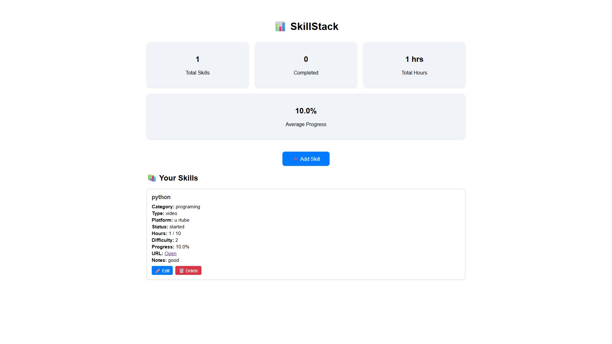
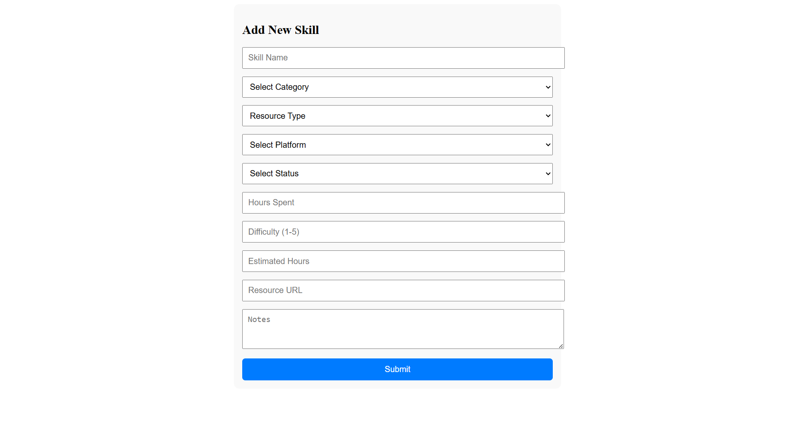

# SkillStack – Frontend

SkillStack is a personal skill-building tracker that helps users manage and track their learning goals like courses, tutorials, and certifications.

This is the **ReactJS frontend** of the project.

---


## 💡 Features

- Add new skills with:
  - Skill name
  - Category (e.g., Programming, Design)
  - Resource type (video, course, article)
  - Platform (Udemy, YouTube, Coursera, etc.)
  - Learning status (Started, In-Progress, Completed)
  - Hours spent, estimated hours, difficulty, notes, and URL

- Dashboard to:
  - View progress summary
  - See category-wise and status-wise breakdown
  - Track total hours spent

- Simple and clean UI with:
  - React Router navigation
  - Forms with validation
  - Responsive design (mobile-friendly)

---

## 🖼️ Screenshots

### Dashboard



### Add Skill Page




---

## 🛠️ Tech Stack

- ReactJS
- Axios
- React Router

---

## ▶️ Getting Started

```bash
git clone https://github.com/Annmary8/SkillStack-Frontend.git
cd SkillStack-Frontend
npm install
npm start
